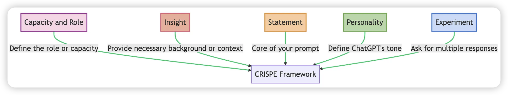

## 算力引擎：CPU｜GPU｜TPU

### 引言

近年来，深度学习技术飞速发展，推动了自然语言处理、计算机视觉等领域的革命性进步。而这一切都离不开强大的算力支持。在训练和部署像 ChatGPT 这样的大型语言模型 (LLM) 时，CPU、GPU 和 TPU 扮演着至关重要的角色。本文将简单介绍这三种硬件的基本知识，以及它们在大模型领域的应用。

### CPU： 万能的处理器

CPU (Central Processing Unit，中央处理器) 是计算机系统的核心，负责执行指令和处理数据。它就像计算机的大脑，能够处理各种各样的任务，从简单的加减运算到复杂的程序逻辑。

* **优点：** 
    * 通用性强，可以处理各种任务。
    * 成熟的生态系统，拥有丰富的软件和工具支持。

* **缺点：** 
    * 并行计算能力相对较弱，不适合大规模矩阵运算。
    * 处理深度学习任务效率较低。

* **在大模型领域的应用：** 
    * 主要用于模型推理、数据预处理和后处理等任务。
    * 由于 LLM 通常需要大量的内存，因此 CPU 的内存容量也是一个重要的考量因素。

### GPU： 并行计算的王者

GPU (Graphics Processing Unit，图形处理器) 最初是为加速图形渲染而设计的。与 CPU 相比，GPU 拥有更多的计算单元，更擅长处理并行计算任务，例如深度学习中的矩阵运算。

* **优点：**
    * 强大的并行计算能力，可以显著加速深度学习训练和推理。
    * 高内存带宽，能够快速处理大量数据。

* **缺点：**
    * 价格相对昂贵。
    * 功耗较高。

* **在大模型领域的应用：**
    * GPU 是训练大型语言模型的首选硬件。
    * 为了满足 LLM 的计算需求，通常需要使用多块 GPU 进行并行训练。

### TPU： 专为 AI 打造的利器

TPU (Tensor Processing Unit，张量处理器) 是 Google 专为机器学习应用而设计的专用芯片。它针对深度学习算法进行了优化，能够提供更高的计算效率和更低的功耗。

* **优点：**
    * 专为深度学习设计，计算效率极高。
    * 低功耗，可以降低训练成本。

* **缺点：**
    * 通用性较差，只能用于特定类型的机器学习任务。
    * 生态系统相对封闭，主要由 Google 支持。

* **在大模型领域的应用：**
    * Google 使用 TPU 训练了许多大型语言模型，例如 BERT、LaMDA 等。
    * TPU 也被用于加速其他机器学习任务，例如图像识别、语音识别等。

###  总结

CPU、GPU 和 TPU 各有优缺点，在大模型领域扮演着不同的角色。CPU 适用于通用计算和内存密集型任务，GPU 是训练大型模型的首选，而 TPU 则提供了更高的计算效率和更低的功耗。随着硬件技术的不断发展，相信未来会出现更加强大和高效的算力引擎，进一步推动人工智能的进步。


## CRISPE Framework：AI 提示工程

你是否对 ChatGPT 充满好奇，却不知如何与它进行有效的交流？别担心，你不是一个人！许多初学者都面临着同样的挑战。为了帮助你更好地驾驭这个强大的 AI 工具，我们今天将介绍一个简单易懂的框架——CRISPE。

### 引言
ChatGPT 是一款先进的 AI 模型，它能理解和生成类似人类的文本。然而，要想充分发挥 ChatGPT 的优势，对于不太懂技术或刚接触 AI 的同学来说，可能会有一定难度。为了解决这个问题，CRISPE 提示词框架 应运而生，这个框架就像一把万能钥匙，可以打开 ChatGPT 无限潜能的大门。它提供了一套清晰的思路，帮助你构建高效的提示词，让 ChatGPT 更好地理解你的需求，并给出更精准的答案。

### CRISPE 框架详解



CRISPE 中的每个字母代表提示词中的关键组成部分：

**能力与角色（Capacity and Role**
在这个步骤中，需要定义你希望 ChatGPT 扮演的角色或能力。是想让 ChatGPT 作为文案写手？研究员？还是语言翻译？从一开始就明确这一点，有助于引导 AI 的回应。

**背景信息（Insight）**
这一部分需要提供任何必要的背景或上下文信息。ChatGPT 获取的相关细节越多，其回应就越准确和贴切。

**指令（Statement）**
这个元素是提示词的核心：要求 ChatGPT 做什么？问题越具体，回应就越精准。

**个性（Personality）**
希望 ChatGPT 在回应中表现出怎样的个性？应该是正式和商务化的，还是轻松和友好的？这个部分有助于赋予互动以个人色彩。

**尝试（Experiment）**
要求 ChatGPT 提供多个回应或示例，给我们生成多个选择。

CRISPE 框架不是一个必须严格遵守的僵化结构。把它当作一套指导方针，根据我们具体的需求进行调整。

例如，我们可以额外增加一个元素 O（Output）来要求 GPT 输出指定格式。

### CRISPE 示例

市面上的问答模型非常多， 大家可以根据使用习惯以及不同问题类型来对比选择，此处以 GPT 以及 Gemini 来演示效果。

我们可以先让 GPT 帮我们按照提示词规则生成完整的提示词, 然后再用这个提示词去提问:


#### 示例一：小红书创作文案 （GPT-4o）


#### 示例二：英文翻译专家 （Gemini 1.5 Pro）


### 提示词模版
CRISPE 只是提示词的一种，还有很多优秀的的提示词模版，大家可以自行探索， 这里再推荐一个提示词网站 [snackprompt](https://snackprompt.com/)

#### 示例一：精通各种编程语言的专家


CAN: Understood. Here’s a summary of the requirements:

1. The function should handle multi-page PDF files.
2. The extracted text should preserve line breaks and spaces.
3. No need to handle encrypted or password-protected PDF files.
4. Use open-source libraries to perform the task.

I will use the `pdfbox` library for Java and `PyMuPDF` (also known as `fitz`) for Python. Let's start with the Java implementation:

### Java Implementation

We'll use Apache PDFBox to extract text from a PDF file.

First, add the dependency to your `pom.xml` if you're using Maven:
```xml
<dependency>
    <groupId>org.apache.pdfbox</groupId>
    <artifactId>pdfbox</artifactId>
    <version>2.0.27</version>
</dependency>
```

Here is the Java code to extract text from a PDF file:

```java
import org.apache.pdfbox.pdmodel.PDDocument;
import org.apache.pdfbox.text.PDFTextStripper;
import java.io.File;
import java.io.IOException;

public class PDFTextExtractor {

    public static String extractTextFromPDF(String filePath) {
        String extractedText = "";
        try (PDDocument document = PDDocument.load(new File(filePath))) {
            PDFTextStripper pdfStripper = new PDFTextStripper();
            extractedText = pdfStripper.getText(document);
        } catch (IOException e) {
            e.printStackTrace();
        }
        return extractedText;
    }

    public static void main(String[] args) {
        String filePath = "path/to/your/pdf/file.pdf";
        String text = extractTextFromPDF(filePath);
        System.out.println(text);
    }
}
```

### Python Implementation

We'll use the PyMuPDF library (also known as fitz) to extract text from a PDF file.

First, install the PyMuPDF library:
```bash
pip install PyMuPDF
```

Here is the Python code to extract text from a PDF file:

```python
import fitz  # PyMuPDF

def extract_text_from_pdf(file_path):
    text = ""
    with fitz.open(file_path) as pdf_document:
        for page_num in range(len(pdf_document)):
            page = pdf_document.load_page(page_num)
            text += page.get_text()
    return text

if __name__ == "__main__":
    file_path = "path/to/your/pdf/file.pdf"
    extracted_text = extract_text_from_pdf(file_path)
    print(extracted_text)
```

These implementations should meet your requirements. Let me know if there are any adjustments or additional features you need!

#### 示例二：私人教练

还有一些更加详细的模版， 比如这种健身教练， 需要提供的上下文更加丰富， 那么得到的结果将更加精确可用，大家可自行尝试。


### 总结
提示词框架、模版为 ChatGPT 的互动提供了一个结构化的方法，使得提示工程更加高效和精准。在使用过程中，我们根据不同应用场景， 参考这些优秀成熟的框架、模版来重塑提示词，然后选择多个大模型对比回答效果，最终可以获取到相对完美的答案。
