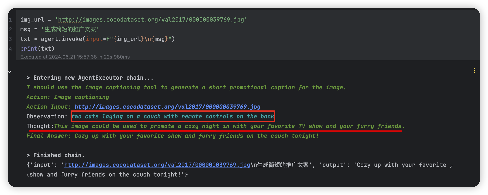

## OpenAI Chat 模型参数

在使用 OpenAI 的聊天模型（如 `gpt-3.5-turbo` 或 `gpt-4`
）时，理解并掌握各种参数的作用可以帮助我们更好地控制模型的行为和响应。本文将介绍常见的参数及其作用，并提供一些实际的使用案例，帮助初学者快速上手。

### 常见参数介绍

#### 1. model

**描述**: 指定要使用的模型名称。  
**示例**: `"gpt-3.5-turbo"`，`"gpt-4"`。

#### 2. max_tokens

**描述**: 控制生成的响应的最大令牌数。令牌可以是一个字符或一个单词，具体取决于语言和上下文。  
**示例**: `max_tokens=200` 表示生成的响应最多包含 200 个令牌。

#### 3. temperature

**描述**: 控制生成文本的随机性。值越高（例如 0.8），生成的文本越随机；值越低（例如 0.2），生成的文本越确定性。  
**示例**: `temperature=0.5`。

#### 4. top_p

**描述**: 使用核采样（nucleus sampling）来限制生成的令牌选择。这个参数会在 [0, 1]
之间选择一个累积概率，以包含最高概率的令牌。
**示例**: `top_p=0.9` 表示仅考虑累计概率为 90% 的令牌。

#### 5. n

**描述**: 指定生成多少个独立的响应。  
**示例**: `n=3` 表示生成三个不同的响应。

#### 6. stop

**描述**: 设置一个或多个停止序列，模型生成的文本在遇到这些序列时会停止。  
**示例**: `stop=["\n", "。"]` 表示生成的文本在遇到换行符或句号时停止。

#### 7. presence_penalty

**描述**: 控制生成内容中主题的多样性。值为正时，鼓励模型生成更多新主题的内容。  
**示例**: `presence_penalty=0.6`。

#### 8. frequency_penalty

**描述**: 控制生成内容中的重复性。值为正时，惩罚模型重复相同内容。  
**示例**: `frequency_penalty=0.5`。

#### 9. logit_bias

**描述**: 调整特定令牌的生成概率。可以用来增加或减少某些令牌出现的可能性。  
**示例**: `logit_bias={"50256": -100}` 大大减少了特定令牌（在这种情况下是结束令牌）的出现可能性。

### 使用案例

以下是一个使用这些参数的示例代码：

```python
from openai import ChatCompletion

response = ChatCompletion.create(
    model="gpt-3.5-turbo",
    messages=[
        {"role": "system", "content": "You are a helpful assistant."},
        {"role": "user", "content": "请写一句情人节红玫瑰的中文宣传语。"}
    ],
    max_tokens=100,
    temperature=0.7,
    top_p=0.9,
    n=1,
    stop=None,
    presence_penalty=0.5,
    frequency_penalty=0.5
)

print(response.choices[0].message["content"])
```

### 参数选择指南

- **生成长度控制**: 使用 `max_tokens` 来控制生成文本的长度。
- **输出随机性**: 使用 `temperature` 和 `top_p` 来控制生成文本的随机性和多样性。
- **生成多个响应**: 使用 `n` 参数来生成多个独立的响应。
- **控制内容重复性**: 使用 `presence_penalty` 和 `frequency_penalty` 来控制生成内容的多样性和重复性。
- **指定停止点**: 使用 `stop` 参数来指定生成内容的停止点。
- **调节特定令牌生成概率**: 使用 `logit_bias` 来调整特定令牌的生成概率。

通过理解和使用这些参数，你可以更好地控制 OpenAI 模型的输出，以满足特定的需求和应用场景。希望这篇文章对你理解和使用 OpenAI
的聊天模型有所帮助。

## LangChain Agent 与 BLIP

**引言**

在当下这个信息爆炸的时代，图片已经成为我们获取信息和表达思想的重要媒介。如何从图片中提取关键信息并将其转化为生动文字描述，一直是
AI 领域的研究热点。本文将向大家介绍如何使用 LangChain Agent 结合 Hugging Face 的 BLIP-Image-Captioning-Large
模型，识别图片信息并自动生成创意文案，让图片说话，让文案更具吸引力。

**准备工作**

核心依赖安装（[pytorch](https://pytorch.org)）：

```bash
pip install langchain transformers torch PIL
```

**LangChain Agent 简介**

LangChain Agent 是一个强大的工具，可以帮助你将不同的 AI 模型组合起来完成复杂任务。它提供了一种灵活的框架，允许你定义一系列步骤，并使用不同的模型来完成每个步骤。

**BLIP 模型介绍**

BLIP (Bootstrapping Language-Image Pretraining) 是一种基于 Transformer 的模型，可以同时理解图像和文本信息。其中，BLIP-Image-Captioning-Large
模型是专门用于生成图像描述的强大模型。

**步骤详解**

1. **加载 BLIP 模型**

    ```python
    import torch
    import requests
    from PIL import Image
    from transformers import BlipProcessor, BlipForConditionalGeneration
    from langchain.tools import BaseTool
    from langchain_openai import ChatOpenAI
    from langchain.agents import initialize_agent, AgentType

    # 初始化图像字幕生成模型（HuggingFace）
    hf_model = "Salesforce/blip-image-captioning-large"
    print("输出 pytorch 版本: ", torch.__version__)

    # 初始化处理器和工具模型
    processor = BlipProcessor.from_pretrained(hf_model)
    model = BlipForConditionalGeneration.from_pretrained(hf_model)
   ```
   ```text
   输出 pytorch 版本:  2.3.1
   ```

2. **加载图片**

    ```python
    # 定义图像字幕生成工具类
    class ImageCaptionTool(BaseTool):
      name = "Image captioning"
      description = "提取图片信息, 生成创意文案."

      def _run(self, url: str):
          # 下载图像并将其转换为PIL对象
          image = Image.open(requests.get(url, stream=True).raw).convert('RGB')
          # 预处理图像
          inputs = processor(image, return_tensors="pt")
          # 生成字幕
          out = model.generate(**inputs, max_new_tokens=500)
          # 获取字幕
          caption = processor.decode(out[0], skip_special_tokens=True)
          return caption

      def _arun(self, query: str):
          raise NotImplementedError("ERR: 不支持异步调用!")
   ```

3.  **创建 LangChain Agent**

    ```python
    # 初始化大语言模型
    llm = ChatOpenAI(temperature=0.8, max_tokens=500)

    # 使用工具初始化 Agent
    tools = [ImageCaptionTool()]
    agent = initialize_agent(
        agent=AgentType.ZERO_SHOT_REACT_DESCRIPTION,
        tools=tools,
        llm=llm,
        verbose=True,
        handle_parsing_errors=True
    )
    print("Agent 输出: ", agent)
    ```
    ```json
    {
        "verbose": true,
        "tags": ["zero-shot-react-description"],
        "agent": {
            "type": "ZeroShotAgent",
            "llm_chain": {
                "prompt": {
                    "input_variables": ["agent_scratchpad", "input"],
                    "template": "Answer the following questions as best you can. You have access to the following tools:\n\nImage captioning - 提取图片信息, 生成创意文案.\n\nUse the following format:\n\nQuestion: the input question you must answer\nThought: you should always think about what to do\nAction: the action to take, should be one of [Image captioning]\nAction Input: the input to the action\nObservation: the result of the action\n... (this Thought/Action/Action Input/Observation can repeat N times)\nThought: I now know the final answer\nFinal Answer: the final answer to the original input question\n\nBegin!\n\nQuestion: {input}\nThought:{agent_scratchpad}"
                },
                "llm": {
                    "type": "ChatOpenAI",
                    "client": "<openai.resources.chat.completions.Completions object at 0x177d31130>",
                    "async_client": "<openai.resources.chat.completions.AsyncCompletions object at 0x176702b20>",
                    "temperature": 0.8,
                    "openai_api_key": "SecretStr('**********')",
                    "openai_api_base": "https://api.openai.com/v1",
                    "openai_proxy": "",
                    "max_tokens": 500
                }
            },
            "output_parser": {
                "type": "MRKLOutputParser"
            },
            "allowed_tools": ["Image captioning"]
        },
        "tools": [
            {
                "type": "ImageCaptionTool"
            }
        ],
        "handle_parsing_errors": true
    }
    ```

4.   **使用 Agent 生成创意文案**

    ```python
    img_url = 'http://images.cocodataset.org/val2017/000000039769.jpg'
    msg = '生成简短的推广文案'
    txt = agent.invoke(input=f"{img_url}\n{msg}")
    print(txt)
    ```

**示例**

我们使用 HuggingFace 中的样例图片：


使用上述代码，可以得到以下结果：

**图片:** two cats laying on a couch with remote controls on the back：【两只猫懒洋洋地躺在沙发上，背上放着遥控器】

**文案:** Cozy up with your favorite show and furry friends on the couch tonight：【今夜，拥暖 sofá，剧里春秋，枕边毛绒，皆是温柔】




**总结**

通过将 LangChain Agent 与 BLIP 模型结合，我们可以轻松地识别图片信息并生成创意文案，为图片赋予灵魂，让信息传递更加生动。
我们可以期待它们在更复杂的场景下发挥更大作用，例如: 自动生成产品介绍、电影剧本等，为我们的生活带来更多便利和创意。
