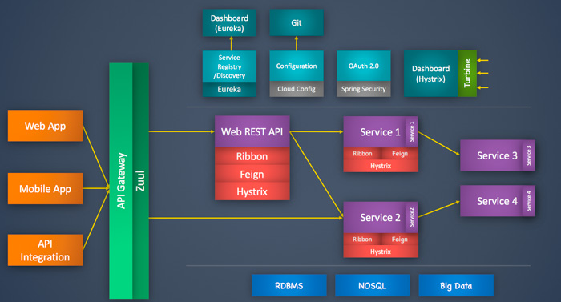

## Overview

> ##### 微服务是什么

微服务的概念最早是 Martin Fowler 和 James Lewis 提出: 是由单一应用程序构成的小服务, 
拥有自己的进程与轻量化处理, 服务依业务功能设计, 以全自动的方式部署, 与其他服务使用 http 通讯.

> ##### Monolithic Application 单体应用

传统的单体应用架构, 就是将应用程序的所有功能都打包成一个独立的单元, 通常是 JAR, WAR, EAR 或 其它归档格式.

**优点:** 对于业务规模不大, 开发团队规模小的时候, 单体应用能一定程度上控制开发和运维成本
- 早期的系统架构, 为人熟知, 学习成本低, 开发上手快
- 易于测试, 因为单体应用包含了所有功能, 没有外部依赖, 一旦部署就可以测试所有功能
- 容易部署, 以 MVC (Spring MVC, Hibernate, Tomcat) 为例, 通常是打成 war 包部署到 tomcat, 然后启动 tomcat,
监听端口, 即可对外提供服务

**缺点:** 当业务规模不断扩大, 开发人员跨团队协作等情况下, 单体应用就会表现出以下问题
- 部署效率低下, 当业务代码越来越多, 依赖的各种资源就越来越多, 编译打包部署一次, 将耗费大量时间
- 团队协作成本高, 当多个开发人员共同修改代码, 因为功能耦合一起, 其中一个功能有问题就需要所有开发人员重新参与其中
- 系统高可用性低, 所有代码都在部署在一个 war 的 tomcat 进程, 因此当一块代码有问题, 很容易导致整个程序不可用
- 不够灵活, 影响持续交付, 因为多个开发人员共同开发一个应用程序, 这就要求必须等到所有人都完成各自开发之后, 才能交付
- 技术栈限制, 单体应用要求使用同一开发语言, 同时单体应用各种功能代码耦合性搞, 难于重构

> ##### 服务化

随着业务的快速发展, 敏捷性, 灵活性, 可扩展性等要求越来越高; 这时的单体应用只会越来越臃肿, 而团队的协作效率低下, 
以及各个功能模块的耦合, 会导致交付变得更加困难. 

服务化是一种可以满足这种快速持续交付的架构设计, **简单来说: 服务化就是把单体应用在进程间通过 JAR
包依赖产生的本地方法调用, 改造成通过 RPC 接口产生的远程方法调用**, 它把复杂的单体应用根据业务功能, 
划分成不同的模块, 每个模块有各自的团队独立开发, 测试, 部署, 同时向外暴露出接口, 各个模块间通过 RPC 相互调用.
这样减少了系统间的代码耦合, 一个模块出问题, 不会导致整个系统的不可用, 同时只需要修复对应的模块, 快速启动.

> ##### Microservice 微服务

随着容器化技术的流行, 服务化思想逐渐被落地实施, 演变成当下主流的微服务架构设计. 

**优点:** 系统被拆分成多个细粒度的子模块, 因此会有以下优势 
- 每个服务独立部署, 易于开发, 维护
- 不受技术栈限制, 可以采用不同的开发语言
- 服务间通过接口交互, 降低耦合 
- 故障隔离, 单个服务故障不会导致整个系统不可用

**缺点:** 微服务会把单体应用的技术债务从开发转到运维
- 服务被拆分的粒度越细, 服务治理就越困难, 对应的运维成本就会越高

## Monolith-to-MicroService

> ##### 服务化拆分

当遇到上述单体架构的问题, 同时开发团队足够支撑微服务架构的时候, 我们可以尝试将单体架构转化为微服务. 将单体应用
拆分为多个微服务, 可以参考业界一些落地的拆分策略: **纵向, 横向, 稳定性, 扩展性, 高性能等需求**, 
这里没有严格的标准, 只能视具体情况而言, 整体上还是以业务维度为主. 如:
- 业务维度(纵向): 根据业务之间的耦合, 数据关系密切度拆分不同的服务
- 功能维度(横向): 公共功能聚合为一个公共服务
- 人员维度: 在实际中的考量，把某几个员工熟悉的业务划分成一个, 便于开发部署
- 性能维度: 性能要求不同的业务拆分出来, 便于独立部署扩展及维护

> ##### 微服务架构

微服务间的调用流程, 简单来说, 首先服务端把自己的信息注册到注册中心, 然后客户端请求注册中心, 
获得提供者的信息并按照约定请求得到返回, 而中间的调用过程中的耗时, 次数, 成功失败等信息需要收集用作监控,
同时每一次调用的链路信息也需要被记录, 用于故障定位和问题追踪, 最后就是调用过程中的错误处理, 通过重试, 降级等治理手段,
来保证整个程序的容错率.

这也正是微服务架构中通常需要依赖的几个基本组件: 服务描述, 注册中心, 服务框架, 服务监控, 服务追踪, 服务治理.

- **服务描述**: 服务描述用来对外描述自己的信息, 如服务名, 提供的信息内容, 返回的格式等; 有如下三种:
  - RestFul API: Http 协议的服务描述, 通过 Swagger, YApi 等工具来管理
  - XML 配置: Rpc 协议的服务描述, 通过 xml 配置文件来暴露信息
  - IDL 文件: Interface description language 通常用于跨语言服务的描述
  
- **注册中心**: 注册中心用来管理服务的发布和订阅, 服务端注册到注册中心供客户端查询使用, 主流程:
  - 服务端启动时, 把描述信息注册到注册中心, 对外发布成服务
  - 客户端启动时, 根据自己配置的服务需求信息, 向注册中心订阅对应的服务
  - 注册中心返回服务端的信息给客户端, 同时监控服务端的信息变化, 将变更通知给客户端
    

     
- **服务框架**: 根据服务描述信息, 确定具体的通信协议, 数据压缩格式等, 可以选择对应的框架来完成服务调用, 如:

| Corp     | Framework     | Protocol  | Serialization   |
| :----:   | :----:        | :----:    | :----:          |
| Pivotal  | Spring Cloud  | HTTP/s    | Json            |
| Alibaba  | Dubbo         | TCP       | Hessian Binary  |
| Google   | gRpc	       | HTTP2     | Protocol Buffers|
| Facebook | Thrift	       | TCP       | ProtoBuf        |

- **服务监控**: 当服务之间可以通信之后, 需要对调用情况进行监控, 以便发现问题:
  - 数据收集: 服务调用的耗时, 是否成功状态收集上传
  - 数据处理: 根据收集到的信息, 计算成功率, QPS等指标
  - 数据展示: 把处理后的指标信息, 美化发布到 Dashboard 便于监控报警  
  
- **服务追踪**: 当服务数量众多, 相互调用频繁, 就需要记录调用链来进行问题定位:
    - Span: 基本工作单元, 消费者调用提供者服务时, 可以传入一个一定规则的 SpanId
    - Trace: 多个服务之间调用时会生成多个 SpanId, 构成一个完整的 trace, 而通过同一个 traceId 实现请求追钟 
  
- **服务治理**: 通过监控发现问题, 然后追踪定位问题, 但是仅仅靠人工解决问题仍然不足, 而服务治理就是一定程度上自动处理故障:
  - 单机故障: 传统模式下靠运维人员重启或者下线节点, 而服务治理可以实现自动摘除故障节点
  - 依赖故障: 当服务故障, 可以通过熔断, 降级等治理手段保证消费者不会连带故障, 同时减轻当前服务的压力, 促使其自动恢复
  - 容量规划: 可以配置一定规则, 来实现服务的自动扩缩容