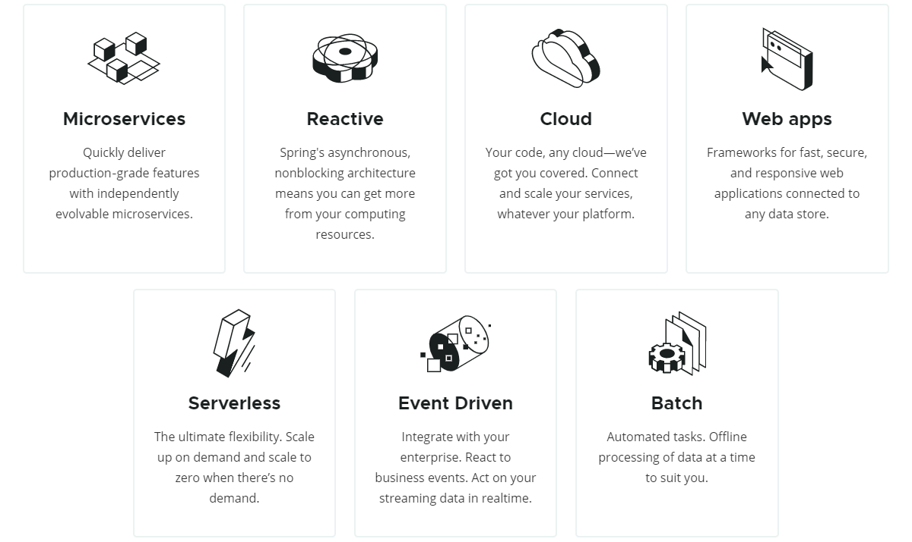

## <u>Overview</u>

> #####  Spring Framework 初始版本由 Rod Johnson 在 2002 年 10 月发布在著作中

Expert One-on-One J2EE Design and Development

Expert One-on-One J2EE Development without ELB
    
Spring 于 2003 年 6 月, 发布在 Apache 2.0 许可证下, 在 Rod Johnson 及 Juergen Hoeller 等人的持续努力下,
不断更新迭代, 目前 (2021.01) 已经发展到了 5.3.3 版本; 值得注意的是, Spring 4.0 版本中增加了对 Java SE8,
Java EE7, 以及 WebSocket 的支持; 而 Spring 5.0 版本中引入了 WebFlux, 致力于打造一个响应式异步 web 框架,
这也是 5.0 的重要理念 Reactive Programming 以及函数式编程.

| Version | Date	| 
| :----:  | :----:  |
| 0.9	  | 2002    |
| 1.0	  | 2003    |
| 2.0	  | 2006    |
| 3.0	  | 2009    |
| 4.0	  | 2013    |
| 5.0	  | 2017    |

> #####  Spring 是当前主流的 Java 开发框架: Spring Framework, Spring Boot, Spring Cloud

> #####  Spring Framework 用于构建企业级应用的轻量级一站式解决方案

> #####  Spring Boot

> #####  Spring Cloud
