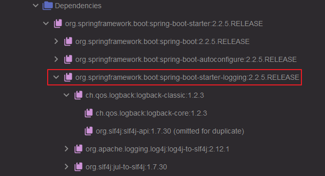
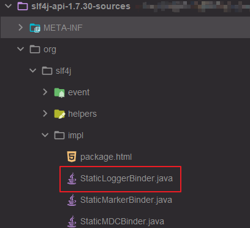
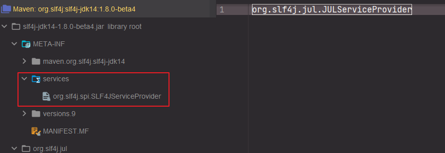

## <font color=red>Java Doc</font>

<p align="right">
<a href="https://blog.joda.org/2012/11/javadoc-coding-standards.html" target="_blank"> 
<font face="Arial" color="green" size="1">| origin-1 | </font>   
</a>
<a href="https://www.baeldung.com/javadoc" target="_blank"> 
<font face="Arial" color="green" size="1">origin-2 |</font>  
</a>
</p>

> ##### <font color=green>Overview</font>

Javadoc 是 java 编程中很重要的一部分, 同时也是 software project 成功的因素之一. 完整的 javadoc 最终以 html
形式渲染在浏览器中, 然而实际情况, 大多数情况我们很少会看完整的 html 页面, 通常是在阅读源码的时候去阅读上面的注释,
所以一个最佳目标, 就是保持你的 javadoc 像代码一样可读.

> ##### <font color=green>Javadoc Summary</font>

Javadoc 类型: Class Level, Field Level, Method Level.

- **Class Level**

```java
/**
* Hero is the main entity we'll be using to . . .
* 
* Please see the {@link ... Person} class for true identity
* 
* @author Captain America
*/
public class SuperHero extends Person {
    private String heroName;
}
```

- **Field Level**

```java
public class SuperHero extends Person {
    /**
     * The public name of a hero that is common knowledge
     */
    private String heroName;
}
```

- **Method Level**

```java
public class SuperHero extends Person {
    private String heroName;

    /**
     * <p>This is a simple description of the method. . .
     * <a href="http://www.supermanisthegreatest.com">Superman!</a>
     * </p>
     * @param  incomingDamage the amount of incoming damage
     * @return  the amount of health hero has after attack
     * @see <a href="http://www.link_to_jira/HERO-402">HERO-402</a>
     * @since 1.0
     */
    public int successfullyAttacked(int incomingDamage) {
        // do things ...
        return 0;
    }
}
```

> ##### <font color=green>Javadoc More Standards</font>

- **Public 和 Protected**

Public 和 Protected 方法应当有相应的 Javadoc.

- **使用标准的 Javadoc 风格注释**

以两个星号开头, 以单个星号结尾, 并且每行要以星号开头.

- **用简单的 HTML tags, 不需要 XHTML**

Javadoc 用 HTML tags 来识别段落, 列表等, 同时 Javadoc Parser 会把没闭合的 tags 自动闭合.

- **用单个 \<p> 来分割段落**

Javadoc 经常会需要分段, 在两段之间写上一行 \<p>.
```java
/**
 * First paragraph.
 * <p>
 * Second paragraph.
 * May be on multiple lines.
 * <p>
 * Third paragraph.
 */
public class SuperHero extends Person {
    // ...
}
```

- **用单个li来标记列表项**

列表在 Javadoc 中也很常用, 推荐的做法是用一个 \<li> 作为每项的开头.
```java
/**
 * First paragraph.
 * <p><ul>
 * <li>the first item
 * <li>the second item
 * <li>the third item
 * </ul><p>
 * Second paragraph.
 */
public class SuperHero extends Person {
    // ...
}
```

- **首句很重要**

Javadoc 的首句是一个总的摘要, 在折叠的时候只会显示这一句. 因此首句必须是个总结性的描述, 最好简洁有力, 同时建议
首句自成一个段落, 这让代码看起来更清晰.

对于英文注释, 推荐使用第三人称来描述, 比如 "Gets the foo", "Sets the bar", "Consumes the baz". 避免使用
第二人称, 比如 "Get the foo".

- **用 "this" 指代类的对象**

描述这个类的一个实例的时候, 用 "this" 来指代它, 比如 "Returns a copy of this foo with the bar value updated".

- **别写太长的句子**

尽量让一句话能容纳在一行中, 一般来说一行有 80 到 120 个字符. 新的句子就另起一行, 增加可读性, 同时便于以后改写.

- **正确使用 @link 和 @code**

很多地方的描述需要涉及到其他类或方法, 这时最好用 @link 和 @code.

@link 会最终变成一个超链接, 它有以下几种形式:

```java
/**
 * First paragraph.
 * <p>
 * Link to a class named 'Foo': {@link Foo}.
 * Link to a method 'bar' on a class named 'Foo': {@link Foo#bar}.
 * Link to a method 'baz' on this class: {@link #baz}.
 * Link specifying text of the hyperlink after a space: {@link Foo the Foo class}.
 * Link to a method handling method overload {@link Foo#bar(String,int)}.
 */
public class Foo {
    public void baz(){
        // ...
    }
    public void bar(){
        // ...
    }
    public void bar(String str, int i){
        // ...
    }
}
```

- **不要在首句中使用 @link**

Javadoc 的首句被用作概要, 但是首句中的超链接会让读者感到混乱. 所以, 当避免在首句中使用  @link 引用其它类或方法,
可以使用 @code 代替, 第二句开始再用 @link.


- **null, true, false 不必用 @code 标记**

null, true, false 这些词在 Javadoc 中太常用了, 如果每次都加上 @code, 无论是对读者还是作者都是个负担.


- **使用 @param, @return 和 @throws**

几乎所有方法都会输入几个参数, 输出一个结果, @param 和 @return 就是用来描述这些输入输出参数的, @throws 用于描
述方法抛出的异常. 如果有多个输入参数, @param 的顺序也要和参数一致. @return 应当始终放在 @param 之后, 然后才是 @throws.


- **用短语来描述 @param 和 @return**

@param 和 @return 后面跟的的描述是个短语, 而非完整的句子, 用小写字母开头, 结尾也不需要用句号.


- **用 if- 句来描述 @throws**

@throws 通常跟着一个 "if" 句子来描述抛异常的情形, 比如 "@throws IllegalArgumentException if the file could not be found".


- **@param 的参数名之后空两格**

在源代码中阅读 Javadoc 的时候, 如果参数名后面只有一个空格, 读起来会有点困难, 两个空格就好很多.
另外, 避免把参数按列对齐, 否则参数改名, 增减参数的时候会很麻烦.

```java
public class SuperHero extends Person {
    /**
     * <p>This is a simple description of the method. . .
     * <a href="http://www.supermanisthegreatest.com">Superman!</a>
     * </p>
     * @param  incomingDamage the amount of incoming damage
     * @return  the amount of health hero has after attack
     * @see <a href="http://www.link_to_jira/HERO-402">HERO-402</a>
     * @since 1.0
     */
    public int successfullyAttacked(int incomingDamage) {
        // do things ...
        return 0;
    }
}
```

> ##### <font color=green>Javadoc Generation</font>

当完成代码中的 javadoc 之后, 我们可以使用 jdk 内置的命令行工具或者 maven 插件来生成 javadoc page.

- **JDK 命令行工具**

简单来说, 通过 -d 指定生成路径, src 下面是 javadoc 的 classes 文件. 此外, 还有一些其他参数

```shell
javadoc -d doc src\*
```

但是, 通常会使用 IDE 内置的生成工具, 如 IDEA 中的 Tools -> Generate JavaDoc.

- **Maven Plugin**

在 maven 中配置插件:

```xml
<build>
    <plugins>
        <plugin>
            <groupId>org.apache.maven.plugins</groupId>
            <artifactId>maven-javadoc-plugin</artifactId>
            <version>3.0.0</version>
            <configuration>
                <source>1.8</source>
                <target>1.8</target>
            </configuration>
            <tags>
            ...
            </tags>
        </plugin>
    </plugins>
</build>
```

通过命令行, 或者 IDE 可视化界面生成 page.
```shell
mvn javadoc:javadoc
```


## <font color=red>Logging System</font>

<p align="right">
<a href="https://www.loggly.com/ultimate-guide/java-logging-basics/" target="_blank"> 
<font face="Arial" color="green" size="1">| origin-1 |</font>  
</a>
<a href="https://segmentfault.com/a/1190000038491835" target="_blank"> 
<font face="Arial" color="green" size="1">| origin-2 | </font>   
</a>
<a href="https://blog.csdn.net/bjchenxu/article/details/108031101" target="_blank"> 
<font face="Arial" color="green" size="1">| origin-3 | </font>   
</a>
</p>

> ##### <font color=green>Overview</font>

对于程序的运行以及调试, 日志记录是不可或缺的一个环节; 日志记录了程序的状态数据, 有助于我们在程序的不同阶段做出相应的处理, 如:

- 开发调试阶段: 日志信息有助于我们高效定位问题点
- 应用运维阶段: 日志系统帮助我们实时监控系统, 记录异常信息及时告警
- 数据分析阶段: 通过日志系统收集的海量数据, 可以对用户的行为做出针对性分析, 一定程度帮助系统业务改善以及架构的演化

> ##### <font color=green>Java Logging History</font>

Java 日志系统看起来还是很混乱, 因为早期没有一个固定的标准, 导致多个不同日志框架的诞生, 简单来看框架演变过程如下:


- [Log4j][1]

Apache Log4j 是由 Ceki Gulcu 创建的一种基于 Java 的日志记录工具, 改变了通过 system.out 记录日志的传统方法.

- [JUL][2]

Sun 公司拒绝把 log4j 纳入 jdk, 并且在 jdk 1.4 中引入了类似的日志工具 JUL (java.util.logging).

- [Commons Logging][3]

为了日志接口与实现的解耦, Apache 推出了 JCL (Jakarta Commons Logging), 它定义了一套日志接口, Log4j / JUL
可以提供实现. JCL 基于动态绑定来寻找具体实现的日志框架, 在使用时只需要用它定义的接口编码, 程序运行时通过 ClassLoader
动态加载具体的实现; 因此,可以灵活选择 log4j 或 JUL.

- [Slf4j][4] / [Logback][5]

Slf4j 是一个日志门面, 只提供接口, 具体实现由 Logback 完成, 同样支持 JUL, Log4j, Log4j 2 等日志实现.
Ceki Gulcu 与 Apache JCL 制定的标准存在分歧; 因此, 离开 Apache 并创建了 Slf4j 和 Logback 两个项目. 这也是
为什么二者更得人心, 毕竟出自于同一个作者, 天然适配.

- [Log4j 2][6]

Apache 推出的 Log4j 2 是 Log4j 的升级版本, 因为 Slf4j 和 Logback 的流行, 为了保住自家 JCL 和 Log4j 地位,
Apache 对 log4j 进行了大量优化 因此使用 Apache 的 Commons Logging 和 Log4j2 也是一个不错的选择.

- [Tinylog][7]

最后提一下 tinylog, 一个更加轻量级的日志框架, 不限于 java 同时支持其他 JVM 语言, 如: Kotlin, Scala. 官方页面
的 benchmark 数据显示性能卓越.

> ##### <font color=green>Java Logging Framework</font>

上述日志框架, 总体可以分为两类, 日志门面和日志实现系统.


- 日志门面: 只提供日志相关的接口定义, 动态 (JCL) 或者静态 (Slf4j) 地寻找具体的日志实现, 从而使接口和实现解耦,
  可以灵活地选择具体的框架.

- 日志系统: 日志具体地实现, 包括日志级别控制, 日志打印格式, 日志输出形式 (输出到数据库, 输出到文件, 输出到控制台等).

将日志门面和日志实现分离其实是一种典型的门面模式, 可以在不改动代码的情况下, 实现日志框架的自由切换,
而开发者只需要掌握日志门面的 API.

我们可以不使用 Sl4j 这种日志门面, 仅仅使用一个具体的日志实现框架; 但是, 对于一个系统而言,
假如不同模块使用了不同的日志框架, 如: 我们引用了 A.jar, B.jar, C.jar 分别使用了 Logback, Log4j, JUL,
那么整个项目就需要同时维护这三种日志框架, 而此时门面模式的作用就体现出来了, 日志门面会提供一个适配层,
来统一处理这三种日志框架的调用, 这个适配层向上就会抽象出一个门面层, 整个系统只需要调用门面的接口即可.

> ##### <font color=green>Java Logging Level</font>

不同日志框架的日志级别有些许差异, 我们通常使用三种, INFO - 用于生产环境中输出程序运行的一些重要信息,
WARN - 警告提示, ERROR - 打印错误和异常信息, 可以使用这个级别来减少日志输出量.

- JUL: 定义了 7 个日志级别, 从严重到普通依次是:
    - **SEVERE, WARNING, INFO, CONFIG, FINE, FINER, FINEST**

- Log4j: 定义了 8 个日志级别, 从严重到普通依次是:
    - **OFF, FATAL, ERROR, WARN, INFO, DEBUG, TRACE, ALL**

- Logback: 定义了 5 个日志级别, 从严重到普通依次是:
    - **ERROR, WARN, INFO, DEBUG, TRACE**

> ##### <font color=green>Spring Logging Framework</font>

- Spring 框架默认使用 Apache JCL + Log4j 作为日志输出:


> ##### <font color=green>Alibaba Logging Guidelines</font>

【强制】 应用中不可直接使用日志系统 (Log4j, Logback) 中的 API, 而应依赖使用日志框架 SLF4J 中的 API,
使用门面模式的日志框架, 有利于维护和各个类的日志处理方式统一.
```java
import org.slf4j.Logger;
import org.slf4j.LoggerFactory;

public class Test {
    private static final Logger logger = LoggerFactory.getLogger(Test.class);
    
    // ... ...
}
```

- SpringBoot 默认使用 Slf4j + Logback 作为日志输出:



[1]: https://logging.apache.org/log4j/1.2/manual.html "let's go"
[2]: https://docs.oracle.com/en/java/javase/12/docs/api/java.logging/java/util/logging/package-summary.html "let's go"
[3]: https://commons.apache.org/proper/commons-logging/ "let's go"
[4]: http://www.slf4j.org/ "let's go"
[5]: http://logback.qos.ch/index.html "let's go"
[6]: http://logging.apache.org/log4j/2.x/manual/index.html "let's go"
[7]: https://tinylog.org/v2/ "let's go"


## <font color=red>Slf4j</font>

<p align="right">
<a href="http://www.slf4j.org/legacy.html" target="_blank"> 
<font face="Arial" color="green" size="1">| origin-1 |</font>  
</a>
<a href="https://blog.csdn.net/bjchenxu/article/details/108031101" target="_blank"> 
<font face="Arial" color="green" size="1">| origin-2 | </font>   
</a>
<a href="https://albenw.github.io/posts/e31dfd0e/" target="_blank"> 
<font face="Arial" color="green" size="1">| origin-3 | </font>   
</a>
</p>

> ##### <font color=green>Overview</font>

Simple Logging Facade for Java 是由 Ceki Gulcu 设计的一个日志抽象层. Ceki Gulcu 是 Log4j 的前作者,
当时与 Apache 在定义日志抽象定义时意见不合, 因此离开 Apache 并且推出 Slf4j, 同时提供了具体日志实现 Logback;
目前 Spring Boot 内置日志框架就是 Slf4j + Logback.

> ##### <font color=green>Slf4j Framework</font>

对于新项目而言, 我们可以直接选择 Slf4j + Logback 来控制日志, 但是, 对于遗留项目, 我们就需要维护不同的日志框架;
因此, 为了统一这些日志框架的调用, Ceki Gulcu 又提供了一个桥接层来把这些不同的日志框架重定向到 Slf4j, 经过 Slf4j 之后,
就进入了适配层, 会自动选择 JUL, Log4j, JCL 等具体实现的日志框架. 而 Logback 本就是 Slf4j 默认实现,
因此也不需要 Slf4j-xx 来适配.


> ##### <font color=green>Bridge & Adapt</font>

如图所示, 可以通过不同的 jar 包来实现其他日志框架桥接到 Slf4j, 同时指定具体的日志框架作为 Sl4j 的具体实现.

因此, 最复杂的一种情况, 我们的系统中分别使用了 JCL, Log4j, JUL 三种不同的日志实现, 这时只需要引入三种对应的 jar
就可以把所有日志请求统一委托到 Slf4j 中处理.

- Bridge
    - jcl-over-slf4j: 把 Jakarta Commons Logging 委托到 Slf4j
    - log4j-over-slf4j: 把 Log4j 委托到 Slf4j
    - jul-to-slf4j: 把 JUL 委托到 Slf4j

当我们系统已经在使用 Slf4j, 但是某些特殊情况, 有需要采用指定的日志实现, 这时候我们可以通过引入下列对应的 jar
来指定 Slf4j 使用对应的日志实现.

- Adapt
    - slf4j-jcl: 把请求到 Slf4j 的日志委托到 JCL 来处理
    - slf4j-log4j12: 把请求到 Slf4j 的日志委托到 log4j 来处理
    - slf4j-jdk14: 把请求到 Slf4j 的日志委托到 JUL 来处理


> ##### <font color=green>Infinite Loop</font>

在使用 Slf4j 的时候, 要注意 jar 包的循环依赖问题, 当引入了同一种日志框架的桥接和适配 jar 会造成无线循环,
如下图: 在使用 Slf4j 的时候, 同时引入了 log4j-over-slf4j 和 slf4j-log4j12.


这时就会导致 StackOverflowError:

```text
SLF4J: Detected both log4j-over-slf4j.jar AND bound slf4j-log4j12.jar on the class path, preempting StackOverflowError. 
SLF4J: See also http://www.slf4j.org/codes.html#log4jDelegationLoop for more details.
Exception in thread "main" java.lang.ExceptionInInitializerError
	at org.slf4j.impl.StaticLoggerBinder.<init>(StaticLoggerBinder.java:72)
	at org.slf4j.impl.StaticLoggerBinder.<clinit>(StaticLoggerBinder.java:45)
	at org.slf4j.LoggerFactory.bind(LoggerFactory.java:150)
	at org.slf4j.LoggerFactory.performInitialization(LoggerFactory.java:124)
	at org.slf4j.LoggerFactory.getILoggerFactory(LoggerFactory.java:417)
	at org.slf4j.LoggerFactory.getLogger(LoggerFactory.java:362)
	at org.slf4j.LoggerFactory.getLogger(LoggerFactory.java:388)
	at ta.main(ta.java:12)
```

!> **<font color=red>因此, 需要避免同一时间出现下列组合:</font>**

- jcl-over-slf4j 和 slf4j-jcl
- log4j-over-slf4j 和 slf4j-log4j12
- jul-to-slf4j 和 slf4j-jdk14

> ##### <font color=green>Adapt Logic</font>

Slf4j 使用的时门面模式, 只提供接口而没有具体实现, 而对于不同的日志实现, Slf4j 是通过不同的适配包, 来完成实际调用,
具体适配逻辑如下:

- **Logger**

我们使用 Slf4j 的 LoggerFactory 获取 Logger 对象:
```java
import org.slf4j.Logger;
import org.slf4j.LoggerFactory;

public class Demo {
    private Logger logger = LoggerFactory.getLogger(Demo.class);
    // ... ...
}
```

- **LoggerFactory**

LoggerFactory 是 ILoggerFactory 的一个 wrapper 类, 主要功能是为不同日志框架 (log4j, logback and JDK 1.4 logging),
提供具体的绑定逻辑, 在编译时期会 Slf4j 会找到具体实现日志的 xxxLoggerFactory.
```java
public final class LoggerFactory {

    // ... ...
    
    public static Logger getLogger(Class<?> clazz) {
        Logger logger = getLogger(clazz.getName());
        if (DETECT_LOGGER_NAME_MISMATCH) {
            Class<?> autoComputedCallingClass = Util.getCallingClass();
            if (autoComputedCallingClass != null && nonMatchingClasses(clazz, autoComputedCallingClass)) {
                Util.report(String.format("Detected logger name mismatch. Given name: \"%s\"; computed name: \"%s\".", logger.getName(),
                        autoComputedCallingClass.getName()));
                Util.report("See " + LOGGER_NAME_MISMATCH_URL + " for an explanation");
            }
        }
        return logger;
    }

    public static Logger getLogger(String name) {
        ILoggerFactory iLoggerFactory = getILoggerFactory();
        return iLoggerFactory.getLogger(name);
    }
}
```

- **GetILoggerFactory**

LoggerFactory 是关键, 这里通过双重检查锁机制保证只初始化一次, 当初始化完成之后的状态为 SUCCESSFUL,
则通过 StaticLoggerBinder 获取到具体的 LoggerFactory; 那么关键就在于 StaticLoggerBinder 的初始化.
```java
public final class LoggerFactory {

    // ... ...

    public static ILoggerFactory getILoggerFactory() {
        if (INITIALIZATION_STATE == UNINITIALIZED) {
            synchronized (LoggerFactory.class) {
                if (INITIALIZATION_STATE == UNINITIALIZED) {
                    INITIALIZATION_STATE = ONGOING_INITIALIZATION;
                    performInitialization();
                }
            }
        }
        switch (INITIALIZATION_STATE) {
            case SUCCESSFUL_INITIALIZATION:
                return StaticLoggerBinder.getSingleton().getLoggerFactory();
            case NOP_FALLBACK_INITIALIZATION:
                return NOP_FALLBACK_FACTORY;
            case FAILED_INITIALIZATION:
                throw new IllegalStateException(UNSUCCESSFUL_INIT_MSG);
            case ONGOING_INITIALIZATION:
                return SUBST_FACTORY;
        }
        throw new IllegalStateException("Unreachable code");
    }

    // initial
    private final static void performInitialization() {
        bind();
        if (INITIALIZATION_STATE == SUCCESSFUL_INITIALIZATION) {
            versionSanityCheck();
        }
    }
}    
```

- **Bind**

初始化最终会走到 bind 方法, 这里绑定了具体 StaticLoggerBinder, 编译时期自动寻找 classpath 下面所有符合条件的
StaticLoggerBinder 单例类, 然后修改初始化状态为 SUCCESSFUL_INITIALIZATION.
```java
public final class LoggerFactory {

    // ... ...

    private static String STATIC_LOGGER_BINDER_PATH = "org/slf4j/impl/StaticLoggerBinder.class";

    private final static void bind() {
        try {
            Set<URL> staticLoggerBinderPathSet = null;
            // skip check under android, see also
            // http://jira.qos.ch/browse/SLF4J-328
            if (!isAndroid()) {
                staticLoggerBinderPathSet = findPossibleStaticLoggerBinderPathSet();
                reportMultipleBindingAmbiguity(staticLoggerBinderPathSet);
            }
            // the next line does the binding
            StaticLoggerBinder.getSingleton();
            INITIALIZATION_STATE = SUCCESSFUL_INITIALIZATION;
            reportActualBinding(staticLoggerBinderPathSet);
            fixSubstituteLoggers();
            replayEvents();
            // release all resources in SUBST_FACTORY
            SUBST_FACTORY.clear();
        } catch (Exception e) {
            
            // ... ...
            
            failedBinding(e);
            throw new IllegalStateException("Unexpected initialization failure", e);
        }
   }
}
```

- **StaticLoggerBinder**


当执行完初始化, 根据状态 SUCCESSFUL_INITIALIZATION 进去 Switch 块, 利用实际寻找的 StaticLoggerBinder
来完成获取不同日志的 LoggerFactory, 同时这些 Factory 都实现了 SLF4J 的 ILoggerFactory, 重写了 GetLogger
这样就可以完成适配, 虽然调用了 SLF4J 的 getLogger 方法, 但是内部获取到的都是具体实现日志 Logger. 如:

**Logback (LoggerContext): StaticLoggerBinder.getSingleton().getLoggerFactory().getLogger()**
```java
public class StaticLoggerBinder implements LoggerFactoryBinder {

    // ... ...

    public static StaticLoggerBinder getSingleton() {
        return SINGLETON;
    }
    // ... ...
    
    public ILoggerFactory getLoggerFactory() {
        if (!initialized) {
            return defaultLoggerContext;
        }

        if (contextSelectorBinder.getContextSelector() == null) {
            throw new IllegalStateException("contextSelector cannot be null. See also " + NULL_CS_URL);
        }
        return contextSelectorBinder.getContextSelector().getLoggerContext();
    }
}

public class LoggerContext extends ContextBase implements ILoggerFactory, LifeCycle {
    
    // ... ...

    @Override
    public final Logger getLogger(final String name) {
        // ... ...
    }
}
```

**JDK14LoggerFactory: StaticLoggerBinder.getSingleton().getLoggerFactory().getLogger()**
```java
public class StaticLoggerBinder implements LoggerFactoryBinder {
    private final ILoggerFactory loggerFactory;

    // ... ...

    public static final StaticLoggerBinder getSingleton() {
        return SINGLETON;
    }
    // ... ...
    
    private StaticLoggerBinder() {
        loggerFactory = new org.slf4j.impl.JDK14LoggerFactory();
    }

    public ILoggerFactory getLoggerFactory() {
        return loggerFactory;
    }
}

public class JDK14LoggerFactory implements ILoggerFactory {

    // ... ...

    public Logger getLogger(String name) {
        // ... ...
    }
}
```

**Log4jLoggerFactory: StaticLoggerBinder.getSingleton().getLoggerFactory().getLogger()**
```java
public class StaticLoggerBinder implements LoggerFactoryBinder {
    private final ILoggerFactory loggerFactory;

    // ... ...

    public static final StaticLoggerBinder getSingleton() {
        return SINGLETON;
    }
    // ... ...
    
    private StaticLoggerBinder() {
        loggerFactory = new Log4jLoggerFactory();
        try {
            @SuppressWarnings("unused")
            Level level = Level.TRACE;
        } catch (NoSuchFieldError nsfe) {
            Util.report("This version of SLF4J requires log4j version 1.2.12 or later. See also http://www.slf4j.org/codes.html#log4j_version");
        }
    }

    public ILoggerFactory getLoggerFactory() {
        return loggerFactory;
    }
}

public class Log4jLoggerFactory implements ILoggerFactory {
    
    // ... ...

    public Logger getLogger(String name) {
        // ... ...
    }    
}
```

> ##### <font color=green>Slf4j Report</font>

这里额外关注几个方法, 关于 Slf4j 中寻找具体实现的时候, 会对结果做出 report:

- findPossibleStaticLoggerBinderPathSet: 通过classloader 寻找到所有 StaticLoggerBinder.class 文件 (JVM
  是允许 classpath 存在多个同样全限定名的类, 此外 JVM 是检索顺序是从前往后, 最终, 会加载顺序在前的类信息.)
```java
public final class LoggerFactory {

    // ... ...
    
    static Set<URL> findPossibleStaticLoggerBinderPathSet() {
        // use Set instead of list in order to deal with bug #138
        // LinkedHashSet appropriate here because it preserves insertion order
        // during iteration
        Set<URL> staticLoggerBinderPathSet = new LinkedHashSet<URL>();
        try {
            ClassLoader loggerFactoryClassLoader = LoggerFactory.class.getClassLoader();
            Enumeration<URL> paths;
            if (loggerFactoryClassLoader == null) {
                paths = ClassLoader.getSystemResources(STATIC_LOGGER_BINDER_PATH);
            } else {
                paths = loggerFactoryClassLoader.getResources(STATIC_LOGGER_BINDER_PATH);
            }
            while (paths.hasMoreElements()) {
                URL path = paths.nextElement();
                staticLoggerBinderPathSet.add(path);
            }
        } catch (IOException ioe) {
            Util.report("Error getting resources from path", ioe);
        }
        return staticLoggerBinderPathSet;
    }
}
```

- reportMultipleBindingAmbiguity: 当发现多个 StaticLoggerBinder 时候打印错误日志.
```java
public final class LoggerFactory {

    // ... ...

    private static void reportMultipleBindingAmbiguity(Set<URL> binderPathSet) {
        if (isAmbiguousStaticLoggerBinderPathSet(binderPathSet)) {
            Util.report("Class path contains multiple SLF4J bindings.");
            for (URL path : binderPathSet) {
                Util.report("Found binding in [" + path + "]");
            }
            Util.report("See " + MULTIPLE_BINDINGS_URL + " for an explanation.");
        }
    }
}
```

- reportActualBinding: 打印最终绑定的 StaticLoggerBinder 信息.
```java
public final class LoggerFactory {

    // ... ...

    private static void reportActualBinding(Set<URL> binderPathSet) {
        // binderPathSet can be null under Android
        if (binderPathSet != null && isAmbiguousStaticLoggerBinderPathSet(binderPathSet)) {
            Util.report("Actual binding is of type [" + StaticLoggerBinder.getSingleton().getLoggerFactoryClassStr() + "]");
        }
    }
}
```

- 当 pom 依赖中引入多个日志实现:
```xml
<!-- ... -->
<dependencies>
    <dependency>
        <groupId>ch.qos.logback</groupId>
        <artifactId>logback-classic</artifactId>
    </dependency>

    <dependency>
        <groupId>org.slf4j</groupId>
        <artifactId>slf4j-log4j12</artifactId>
    </dependency>

    <dependency>
        <groupId>org.slf4j</groupId>
        <artifactId>slf4j-jdk14</artifactId>
    </dependency>
</dependencies>
<!-- ... -->
```

- 启动应用时 SLF4J 会打印错误日志 multiple SLF4J bindings 以及 Actual binding:
```text
SLF4J: Class path contains multiple SLF4J bindings.
SLF4J: Found binding in [jar:file:/C:/Domain/Maven/repository/ch/qos/logback/logback-classic/1.2.3/logback-classic-1.2.3.jar!/org/slf4j/impl/StaticLoggerBinder.class]
SLF4J: Found binding in [jar:file:/C:/Domain/Maven/repository/org/slf4j/slf4j-log4j12/1.7.30/slf4j-log4j12-1.7.30.jar!/org/slf4j/impl/StaticLoggerBinder.class]
SLF4J: Found binding in [jar:file:/C:/Domain/Maven/repository/org/slf4j/slf4j-jdk14/1.7.30/slf4j-jdk14-1.7.30.jar!/org/slf4j/impl/StaticLoggerBinder.class]
SLF4J: See http://www.slf4j.org/codes.html#multiple_bindings for an explanation.
SLF4J: Actual binding is of type [ch.qos.logback.classic.util.ContextSelectorStaticBinder]
```

- 当 pom 依赖中只引入门面, 而没有具体实现的时候:
```xml
<!-- ... -->
<dependencies>
    <dependency>
        <groupId>org.slf4j</groupId>
        <artifactId>slf4j-api</artifactId>
    </dependency>
</dependencies>
<!-- ... -->
```

- 启动应用时 SLF4J 会捕捉 NoClassDefFoundError, 会打印错误日志没有具体日志实现 :
```text
SLF4J: Failed to load class "org.slf4j.impl.StaticLoggerBinder".
SLF4J: Defaulting to no-operation (NOP) logger implementation
SLF4J: See http://www.slf4j.org/codes.html#StaticLoggerBinder for further details.
```

> ##### <font color=green>Slf4j Dummy Class</font>

通过上述可以发现, Slf4j 是通过寻找 classpath 下的 StaticLoggerBinder 来完成具体实现日志框架的绑定,
但是, slf4j-api 这个门面本身的源码中也会有一个 StaticLoggerBinder 类, 也就是一个假的类来占位,
为什么不会绑定这个 dummy 的类呢?



```java
public class StaticLoggerBinder {
    private static final StaticLoggerBinder SINGLETON = new StaticLoggerBinder();
    
    // ... ...

    private StaticLoggerBinder() {
        throw new UnsupportedOperationException("This code should have never made it into slf4j-api.jar");
    }

    public ILoggerFactory getLoggerFactory() {
        throw new UnsupportedOperationException("This code should never make it into slf4j-api.jar");
    }
    
    // ... ...
}
```

打开源码查看 pom 配置, 可以发现在打包的时候, 删除了这个 dummy 的类:
```xml
<!-- ... -->
<plugins>
    <plugin>
        <groupId>org.apache.maven.plugins</groupId>
        <artifactId>maven-antrun-plugin</artifactId>
        <executions>
            <execution>
                <phase>process-classes</phase>
                <goals>
                    <goal>run</goal>
                </goals>
            </execution>
        </executions>
        <configuration>
            <tasks>
                <echo>Removing slf4j-api's dummy StaticLoggerBinder and StaticMarkerBinder</echo>
                <delete dir="target/classes/org/slf4j/impl"/>
            </tasks>
        </configuration>
    </plugin>
</plugins>
<!-- ... -->
```

> ##### <font color=green>Slf4j Service Provider Interface</font>

上面我们了解到, Slf4j 是通过 ClassLoader 寻找绑定具体的 StaticLoggerBinder, 此外, 还需要在打包的时候,
通过 mvn 插件删除 dummy 数据; 而在新的 Slf4j 版本中, 是通过 java 提供的 SPI 机制来完成具体绑定, 这样就避免了,
使用 dummy StaticLoggerBinder 以及打包等额外配置.

- pom 中引入新版本的依赖:
```xml
<!-- ... -->
<dependencies>
    <dependency>
        <groupId>org.slf4j</groupId>
        <artifactId>slf4j-api</artifactId>
        <version>1.8.0-beta4</version>
    </dependency>

    <dependency>
        <groupId>ch.qos.logback</groupId>
        <artifactId>logback-classic</artifactId>
        <version>1.3.0-alpha5</version>
    </dependency>

    <dependency>
        <groupId>org.slf4j</groupId>
        <artifactId>slf4j-log4j12</artifactId>
        <version>1.8.0-beta4</version>
    </dependency>

    <dependency>
        <groupId>org.slf4j</groupId>
        <artifactId>slf4j-jdk14</artifactId>
        <version>1.8.0-beta4</version>
    </dependency>
</dependencies>
<!-- ... -->
```

- bind 流程与之前流程相似, 只是寻找具体的实现框架时, 利用 SPI 机制查找;  可以看出利用 ServiceLoader
  获取所有实现 SLF4JServiceProvider 接口的日志框架, 取出第一个为实际的 PROVIDER.
```java
public final class LoggerFactory {
    // ... ...

    private final static void bind() {
        try {
            List<SLF4JServiceProvider> providersList = findServiceProviders();
            reportMultipleBindingAmbiguity(providersList);
            if (providersList != null && !providersList.isEmpty()) {
                PROVIDER = providersList.get(0);
                PROVIDER.initialize();
                INITIALIZATION_STATE = SUCCESSFUL_INITIALIZATION;
                reportActualBinding(providersList);
                fixSubstituteLoggers();
                replayEvents();
                SUBST_PROVIDER.getSubstituteLoggerFactory().clear();
            }
            // ... ...
        } catch (Exception e) {
            failedBinding(e);
            throw new IllegalStateException("Unexpected initialization failure", e);
        }
    }

    private static List<SLF4JServiceProvider> findServiceProviders() {
        ServiceLoader<SLF4JServiceProvider> serviceLoader = ServiceLoader.load(SLF4JServiceProvider.class);
        List<SLF4JServiceProvider> providerList = new ArrayList<SLF4JServiceProvider>();
        for (SLF4JServiceProvider provider : serviceLoader) {
            providerList.add(provider);
        }
        return providerList;
    }
}
```

- LogbackServiceProvider


```java
public class LogbackServiceProvider implements SLF4JServiceProvider {
    public static String REQUESTED_API_VERSION = "1.8.99"; // !final

    private LoggerContext defaultLoggerContext;
    private IMarkerFactory markerFactory;
    private MDCAdapter mdcAdapter;
    
    // ... ...

    @Override
    public void initialize() {
        defaultLoggerContext = new LoggerContext();
        defaultLoggerContext.setName(CoreConstants.DEFAULT_CONTEXT_NAME);
        initializeLoggerContext();
        markerFactory = new BasicMarkerFactory();
        mdcAdapter = new LogbackMDCAdapter();
        //initialized = true;
    }
}

```

- JULServiceProvider



```java
public class JULServiceProvider implements SLF4JServiceProvider {
    // ... ...

    public void initialize() {
        this.loggerFactory = new JDK14LoggerFactory();
        this.markerFactory = new BasicMarkerFactory();
        this.mdcAdapter = new BasicMDCAdapter();
    }
}
```

- Log4j12ServiceProvider


```java
public class Log4j12ServiceProvider implements SLF4JServiceProvider {
    // ... ...

    @Override
    public void initialize() {
        loggerFactory = new Log4jLoggerFactory();
        markerFactory = new BasicMarkerFactory();
        mdcAdapter = new Log4jMDCAdapter();
    }
}
```

如上, 在 1.8.0-beta4 版本已经使用 SPI 完成门面和具体实现的绑定, 同时也更加符合面向接口编程的范式.


## <font color=red>Logback</font>

<p align="right">
<a href="http://logback.qos.ch/manual/index.html" target="_blank"> 
<font face="Arial" color="green" size="1">| origin-1 |</font>  
</a>
</p>

> ##### <font color=green>Overview</font>


[14]: https://logging.apache.org/log4j/1.2/manual.html "let's go"


